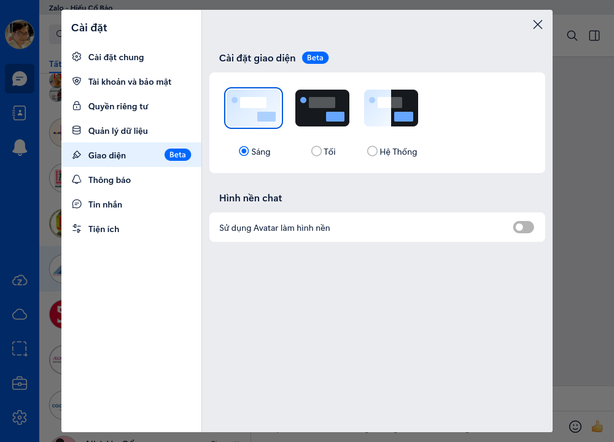

# Zalo for Linux (Unofficial Port) version 25.5.3 base on version of realdtn2 and huanhoahongso3-collab


## Information

**THIS IS NOT USING THE ZALO WEBSITE,IT IS PORTED DIRECTLY FROM THE ZALO MAC DESKTOP CLIENT**

CAN'T DO AS: CALL OR SYNC DATA FROM MOBILE.

THEME: DARK AND LIGHT

LANGUAGE: ENGLISH AND VIETNAMESE

This project is an unofficial port of the MacOS version of Zalo to Linux. The porting process involved extracting the `.dmg` file from the MacOS version and locating the `app.asar` file in the directory, which is typically found in `/Applications/YourAppName.app/Contents/Resources`. The following steps were taken:

1. Extracted `app.asar` with the command:
    ```zsh on macOS
    cd Desktop/
    npm install -g @electron/asar
    
    cd /Applications/Zalo/Contents/Resources
    npx @electron/asar extract app.asar app
    ```
2. Navigated to the extracted directory and ran Zalo using Electron version 22.3.27. Note that using newer versions of Electron result in errors. The command to run Zalo is:
    ```bash
    electron .
    ```

Additionally, `install.sh` is used to add a tray icon using Python.

Working on Nobara 39 KDE Plasma,Ubuntu 22.04 XFCE4





## Installation

Python is required to run the tray icon script.

To install Zalo for Linux, you can choose one of these two:

***Recommended***
```bash
sh -c "$(curl -sSL https://raw.githubusercontent.com/cobaohieu/zalo-linux-unofficial/main/install_curl.sh)"
```

or

```bash
git clone https://github.com/cobaohieu/zalo-linux-unofficial
cd zalo-linux-unofficial
chmod +x install.sh
./install.sh
```
Zalo will be installed to ~/.local/share/Zalo

## Fixes

***Some apt should install first ***
```bash
sudo apt install wget git python3 python3-pip 
```

***Python3: Namespace AppIndicator3 not available***
```bash
sudo apt install gir1.2-appindicator3-0.1
```
***[855265:0809/185712.193181:FATAL:setuid_sandbox_host.cc(157)] The SUID sandbox helper binary was found, but is not configured correctly. Rather than run without sandboxing I'm aborting now. You need to make sure that /home/ubuntu/.local/share/Zalo/electron-v22.3.27-linux-x64/chrome-sandbox is owned by root and has mode 4755.***
```bash
sudo chown root $HOME/.local/share/Zalo/electron-v22.3.27-linux-x64/chrome-sandbox
sudo chmod 4755 $HOME/.local/share/Zalo/electron-v22.3.27-linux-x64/chrome-sandbox
sudo chown root $HOME/Desktop/Zalo.desktop
sudo chmod 4755 $HOME/Desktop/Zalo.desktop
```

## Bugs

There will be some bugs, as I don't have an understanding of how electron work, I won't be able to fix any bugs.


# No Security or Hack, Cheat, Virus, Vulnerable, etc.

I'm not sure about this security. This app is just quick support to text and do not have many function as the official app from Zalo VNG. I hope you could understand for this inconvenience.

# Many thanks to
[https://github.com/realdtn2/zalo-linux-unofficial-2024]
[https://github.com/huanhoahongso3-collab/zalo-linux-unofficial/tree/main]
[https://gist.github.com/muratgozel/fdb854885d6a300004430239dd1f5cfb]
[https://zalo.me/pc]